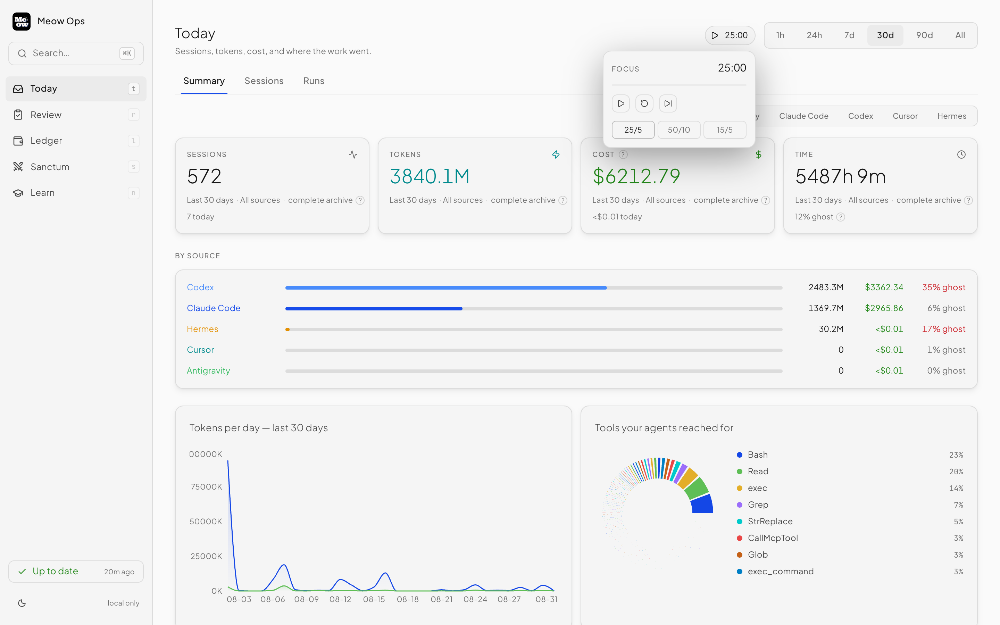
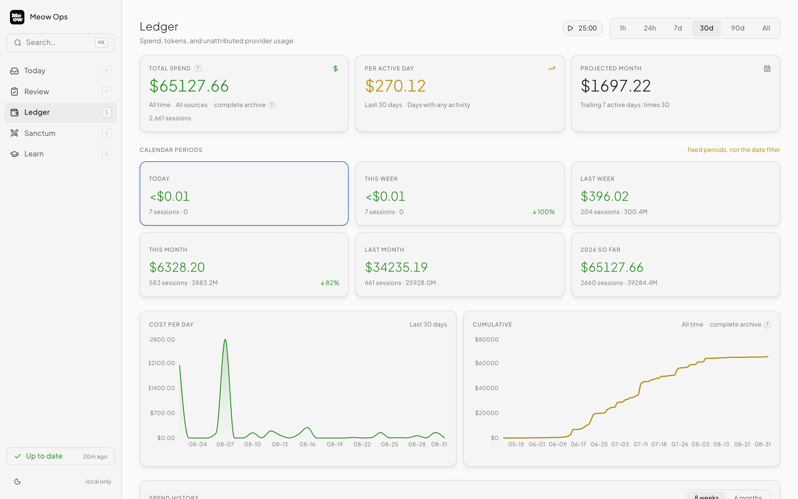
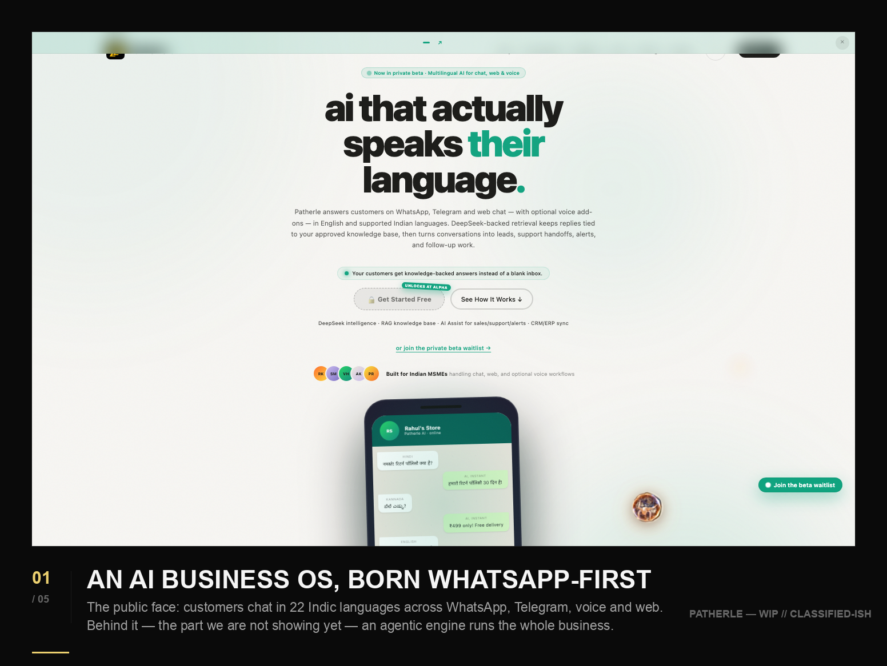
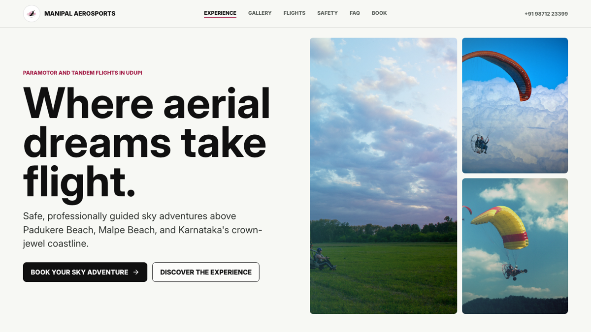

# Meow Creative Haus

Meow Creative Haus is the public marketing site for the studio. It is built with Next.js App Router and now includes the homepage Loop Engineering section, the Patherle teaser route, a public ship log, and the `/lab` showcase page.

- Live site: [meow-creative-haus-2.vercel.app](https://meow-creative-haus-2.vercel.app)
- Repo: [merak3i/meow-creative-haus-2](https://github.com/merak3i/meow-creative-haus-2)
- Current release: `v1.5.0` from `2026-06-14`

## What ships

### Homepage

- Hero with the word-by-word headline and dual CTAs.
- Client marquee with 13 logos served from the Lovable CDN.
- Offers section with the core service stack.
- `/lab` teaser that points into the showcase page.
- `Loop Engineering`, a five-frame tour of The Loom control room.
- `Patherle`, a redacted teaser route with five stills and a build log.
- Ship log with the public release history.
- Authority section with founder bio and LinkedIn CTA.
- Substack feed with server-side RSS and curated fallback posts.
- Footer with social links, email CTA, and Calendly booking.

### `/lab`

- Open-source Meow Ops project block (v1.2.0 inbox: Today, Review, Ledger, Sanctum, Learn).
- `VideoShowcase`.
- `ClientWebsites`.
- `ShortsShowcase`.

### `/patherle`

- Five sanitized screenshots.
- Scroll-tilt reveal.
- Roadmap and build log.

## Screenshots

<table>
  <tr>
    <td width="50%">
      
      <br />
      <sub>Meow Ops Today</sub>
    </td>
    <td width="50%">
      
      <br />
      <sub>Meow Ops Ledger</sub>
    </td>
  </tr>
  <tr>
    <td width="50%">
      
      <br />
      <sub>Patherle teaser</sub>
    </td>
    <td width="50%">
      
      <br />
      <sub>Client website screenshot</sub>
    </td>
  </tr>
</table>

## Stack

- Next.js 14 App Router
- React 18
- TypeScript
- Tailwind CSS 3.4
- Framer Motion 11
- Lenis for smooth scrolling
- `fast-xml-parser` for Substack RSS parsing
- `@radix-ui/react-slot`, `class-variance-authority`, `clsx`, `tailwind-merge`
- Lucide React icons

## Content and integrations

- Substack RSS: [https://impostersyndromeenjoyer.substack.com/feed](https://impostersyndromeenjoyer.substack.com/feed)
- Calendly: [https://calendly.com/mewdiaservice/30min](https://calendly.com/mewdiaservice/30min)
- Lovable CDN for client logos: [https://meowcreativehaus.lovable.app](https://meowcreativehaus.lovable.app)
- YouTube IDs for the video showcase live in `components/VideoShowcase.tsx`

`fetchSubstackFeed()` runs server-side. It revalidates hourly and falls back to curated posts when the feed is unavailable.

## Local setup

```bash
npm install
npm run dev
npm run build
npm run lint
npm run test:lib
npm run start
```

## Deployment

- Vercel hosts the site and auto-deploys on push to `main`.
- GitHub is the source of truth. For release work, merge `dev` into `main`.
- Production and release notes are tracked in [CHANGELOG.md](CHANGELOG.md).
- Rollback guidance lives in [ROLLBACK.md](ROLLBACK.md).

## Repository layout

- `app/` route entry points, including `/lab` and `/patherle`
- `components/` homepage and showcase sections
- `lib/` shared data, RSS parsing, and utilities
- `public/` screenshots, logos, and static assets
- `db/` forward-looking migration scaffolding

## Notes

- Client logos should stay on the Lovable CDN, not in `public/`.
- Client screenshots are local assets under `public/screenshots/`.
- The `package.json` name is legacy. It stays `meow-acquisition-engine`.
